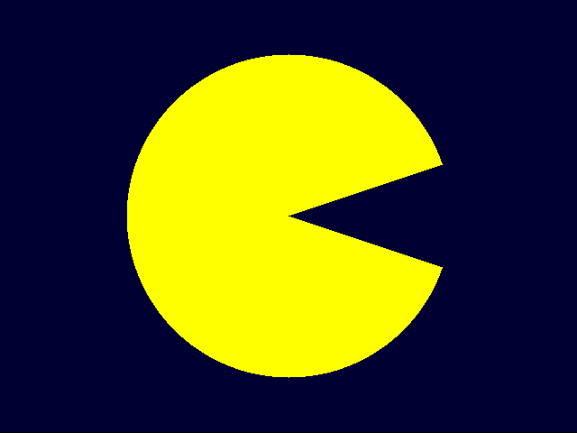

# Bitmap Drawing

This program was written to get some practice with C memory handling and file
writing.
The program reads from an input file commands to draw easy shapes (rectangles,
circles and triangles) and output a bitmap image containing the drawn shapes.

## Compile

Compile using the provided Makefile. Binary will be named "bitmap"

```
make all
```

## Usage

Call program with following parameters:

```
bitmap <input-file> <output-file> <image-width> <image-height>
```

* input-file: path to input file containing the commands (Description of commands see [Commands - Input File](#commands---input-file)
* output-file: path to bitmap file which will be created
* image-width: width of the image in pixels
* image-height: height of the image in pixels

Example Usage
```
./bitmap input.txt output.bmp 640 480
```

input.txt:
```
rectangle id="1" color="000033" x="0" y="0" width="640" height="480"
circle id="2" color="ffff00" x="320" y="240" radius="180"
triangle id="3" color="000033" ax="320" ay="240" bx="500" by="300" cx="500" cy="180"
```

Output:



## Commands - Input File

Each line of the file has to contain exactly one shape.
Shapes which can be drawn are rectangles, circles and triangles.
A line has to begin with 'rectangle', 'circle' or 'triangle' followed
by parameters separated by spaces.

Parameters are given as parameter-name="value", for example: color="ffff00"

The coordinate origin is in the left top corner. Coordinates get bigger from 
left to right and from top to bottom.

### Parameters for all shapes:
* id: 32 bit wide positive number, elements with higher ids are drawn in front of 
* elements with lower ids
* color: 24 bit rgb value given as hexadecimal number (rrggbb)

### Parameters for rectangle:
* x: x coordinate of the left upper corner of the rectangle (in pixel)
* y: y coordinate of the left upper corner of the rectangle (in pixel)
* width: size of rectangle in x direction (in pixel)
* height: size of rectangle in y direction (in pixel)

### Parameters for circle:
* x: x coordinate of center of circle (in pixel)
* y: y coordinate of center of circle (in pixel)
* radius: radius of circle (in pixel)

### Parameters for triangle:
* ax: x coordinate of point A of triangle
* ay: y coordinate of point A of triangle
* bx: x coordinate of point B of triangle
* by: y coordinate of point B of triangle
* cx: x coordinate of point C of triangle
* cy: y coordinate of point C of triangle

example:
```
rectangle id="1" color="000033" x="0" y="0" width="640" height="480"
circle id="2" color="ffff00" x="320" y="240" radius="180"
triangle id="3" color="000033" ax="320" ay="240" bx="500" by="300" cx="500" cy="180"
```
